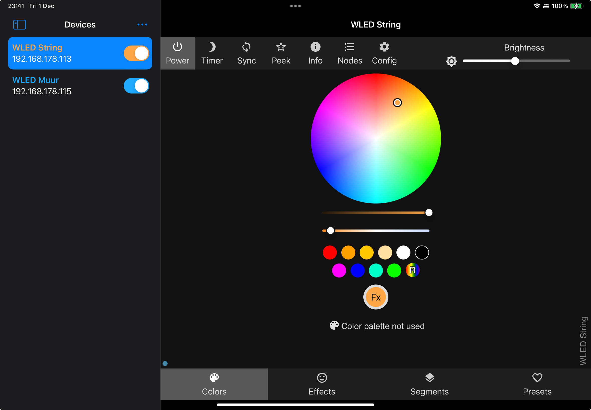
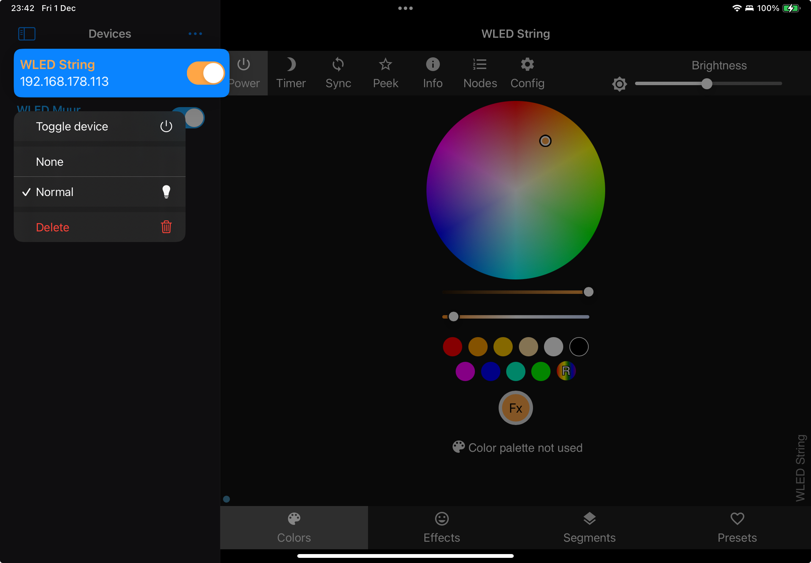
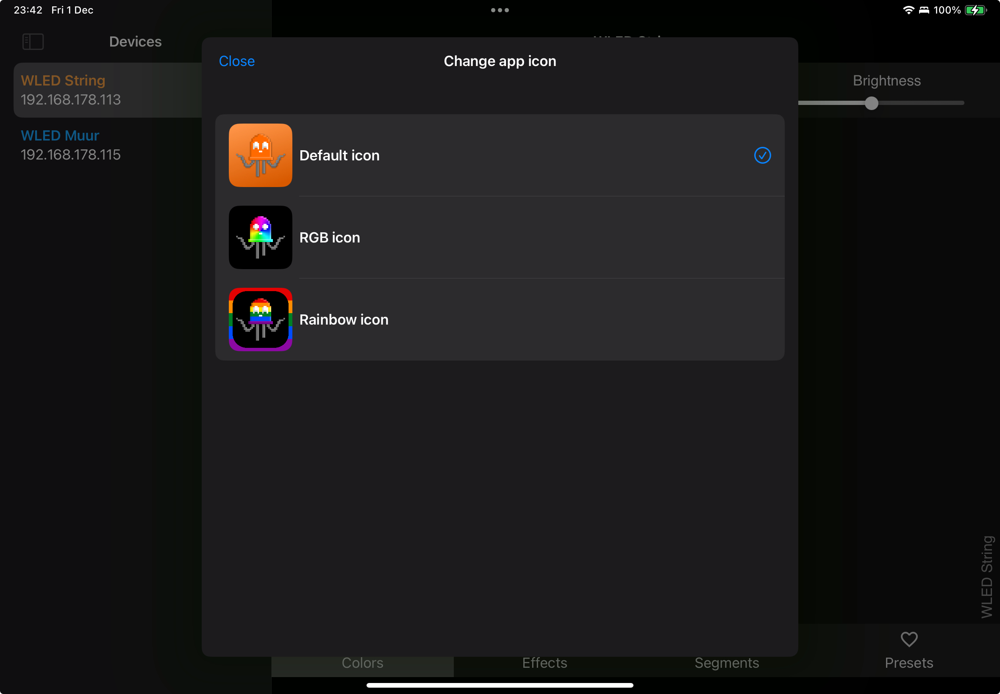

#  WLED App

### (Yet another) app for controlling your WLED devices!

 

## Features

- Discovering devices via [Bonjour](./WLED App/Services/DiscoveryService.swift)
- Toggling devices from the home screen
- Quick preset control from the homepage
- Synchronize saved devices via iCloud
- Apple Watch support (soon)

## Inspiration

A lot of inspiration came [Moustachauve](https://github.com/Moustachauve)'s [WLED-Native-iOS](https://github.com/Moustachauve/WLED-Native-iOS). 
I wanted to see if I could build a WLED app using SwiftUI and the new SwiftData framework. I also wanted to create a prettier app for on iPads and possibly an Apple Watch app.
